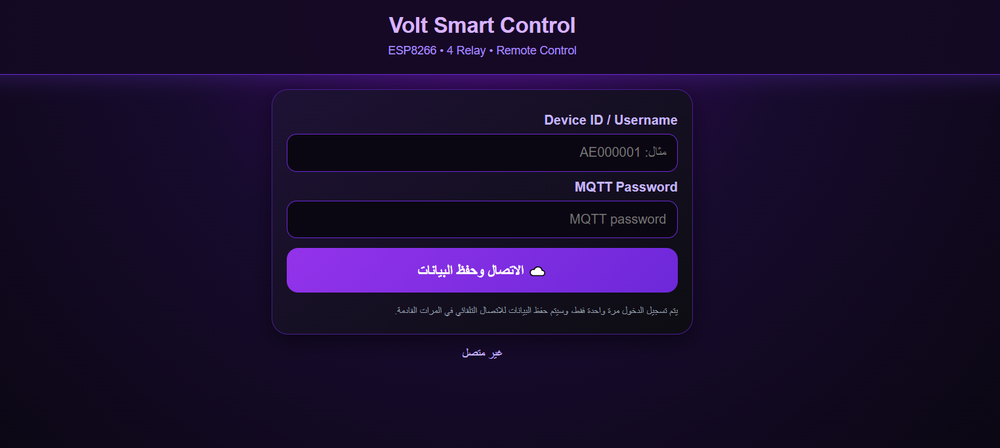
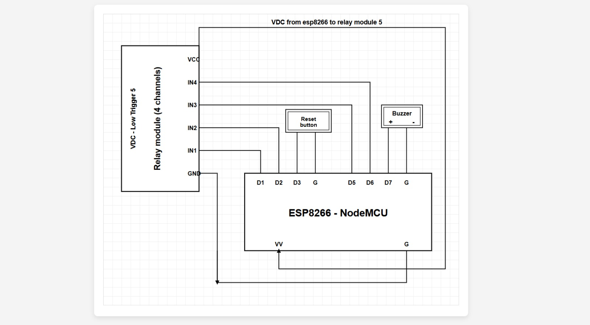

# ESLAM SMART SWITCH

## Smart Home Automation System

**Personal Electronics Engineering Project — Islam Naser**

An ESP8266-based Smart Home Automation System designed for remote control of electrical loads using a 4-channel relay module, MQTT communication, and HiveMQ Cloud.

The system combines embedded hardware, cloud-based communication, and a responsive Web/Mobile control interface into one IoT platform.

---

## 📸 Project Gallery

### 📱 Dashboard



### 🎛️ Smart Control


### 🔌 Wiring



---

## 🚀 Project Overview

The system allows users to remotely control four electrical loads through a Web/Mobile interface.

Communication between the control interface and the ESP8266 is handled through **MQTT over HiveMQ Cloud**, with a dedicated device identity for each controller.

### Main Technologies

* ESP8266 D1 Mini
* 4-Channel Relay Module
* MQTT
* HiveMQ Cloud
* WebSocket / Secure WebSocket (WSS)
* HTML / CSS / JavaScript
* EEPROM
* Wi-Fi

---

## ⚡ Main Features

* 4 independent relay channels
* Individual ON/OFF control
* Turn all relays ON/OFF
* Real-time relay state synchronization
* Remote Web/Mobile control
* MQTT communication
* HiveMQ Cloud integration
* Device-based MQTT identity
* Wi-Fi configuration
* Local Access Point configuration
* Relay name customization
* EEPROM data storage
* Secure MQTT connection using TLS
* Automatic reconnection

---

## 🏗️ System Architecture

```text
             ┌─────────────────────────┐
             │    Web / Mobile App     │
             │  HTML + CSS + JavaScript │
             └────────────┬────────────┘
                          │
                       WSS / MQTT
                          │
                          ▼
             ┌─────────────────────────┐
             │      HiveMQ Cloud       │
             │      MQTT Broker        │
             └────────────┬────────────┘
                          │
                     MQTT over TLS
                          │
                          ▼
             ┌─────────────────────────┐
             │       ESP8266 D1 Mini   │
             │     Smart Switch MCU    │
             └──────┬──────┬──────┬────┘
                    │      │      │      │
                   R1     R2     R3     R4
                    │      │      │      │
                    ▼      ▼      ▼      ▼
                 Load   Load   Load   Load
```

---

## 🔌 Relay Configuration

| Relay   | ESP8266 Pin |
| ------- | ----------- |
| Relay 1 | D1          |
| Relay 2 | D2          |
| Relay 3 | D5          |
| Relay 4 | D6          |

The relay module uses **active-LOW logic**.

---

## ☁️ MQTT Architecture

Each physical controller has its own Device ID.

Example:

```text
AE0000019
```

The MQTT topic structure is:

```text
eng_ahmed_ebaid/devices/<DEVICE_ID>/
```

Example:

```text
eng_ahmed_ebaid/devices/AE0000019/relay1/set
eng_ahmed_ebaid/devices/AE0000019/relay1/state

eng_ahmed_ebaid/devices/AE0000019/relay2/set
eng_ahmed_ebaid/devices/AE0000019/relay2/state

eng_ahmed_ebaid/devices/AE0000019/relay3/set
eng_ahmed_ebaid/devices/AE0000019/relay3/state

eng_ahmed_ebaid/devices/AE0000019/relay4/set
eng_ahmed_ebaid/devices/AE0000019/relay4/state
```

### Supported Commands

```text
ON
OFF
TOGGLE
```

### All Relays

```text
eng_ahmed_ebaid/devices/AE0000019/all/set
eng_ahmed_ebaid/devices/AE0000019/all/state
```

> The current MQTT namespace is retained for compatibility with the existing HiveMQ configuration and device firmware.

---

## 📱 Web / Mobile Remote Control

The project includes a responsive Web/Mobile control interface.

Users can:

* Connect to HiveMQ Cloud
* Control each relay independently
* Control all relays simultaneously
* View real-time relay states
* Receive relay names from the ESP8266
* Automatically reconnect after connection loss

The interface is located in:

```text
mobile-web-app/
└── remote_control.html
```

---

## 🔐 Security

The system uses device-specific MQTT credentials and MQTT over TLS.

Real credentials should not be included in a public repository.

> Never publish MQTT passwords, Wi-Fi passwords, or other privat
